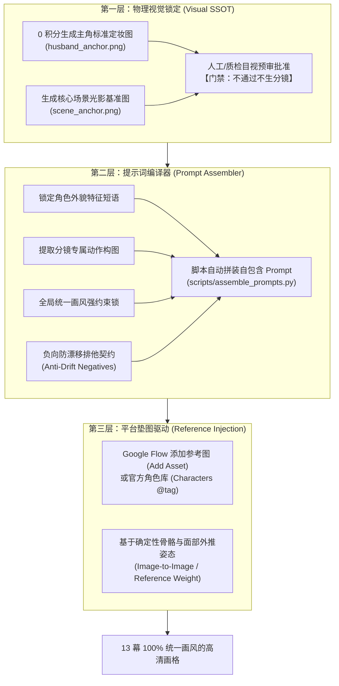

# 动态漫画与图文分镜：角色一致性、场景锚定与防漂移工业化 SOP

> **文档版本**：v1.0 (2026-09)  
> **适用题材**：`comic_story`（动态漫画故事）、图文 PPT 效果视频、知识/情感故事叙述  
> **核心目标**：彻底消灭分镜生成过程中的“画风撕裂”、“人物换脸”、“突变真人实拍”与“对话气泡乱码”，在 0 积分成本下实现工业级一致性交付。

---

## 一、血泪案例复盘与反面教材（Anti-Patterns）

在 Project `002_infidelity_and_torn_soul`（《站在男人角度告诉你，犯错的男人还会不会爱自己老婆》）首轮生产中，暴露了极具代表性的“AI 幻觉与一致性崩溃”现象：

| 分镜编号 | 生成结果 | 致命问题 | 触发根因 |
|---|---|---|---|
| **Panel 01** | 黑白墨线素描日漫，青年东亚男士 | 风格基准正常 | 包含明确的 `manga ink` 与 `Asian man` |
| **Panel 05** | 彩色霓虹美漫，老态微醺中年男 | **画风与年龄突变** | 提示词包含 `neon-lit bar, graphic novel`，未锁定黑白单色与统一人物外貌 |
| **Panel 11** | **写实单反摄影，欧美胡茬男性洗脸** | **灾难性真人化漂移** | 提示词漏写 `Asian` 和 `manga ink`，写了 `cinematic side lighting`，误触真人电影写实权重 |
| **Panel 13** | 欧美报刊连环画，带英文对话气泡 | **实体对话框污染** | 提示词写入 `comic book final panel`，模型自动填充了美漫台词气泡与英文角色 |

### 核心定性：
这不是模型偶然失误，而是**缺乏工业化前置定妆门禁、依赖手写纯文本提示词抽盲盒、缺少反向排他约束**导致的系统性流程缺陷。

---

## 二、三层一致性锁定体系 (The 3-Layer Consistency Architecture)



---

## 三、标准作业操作规程 (SOP)

### 步骤 0：定妆与场景基准落地（Visual Anchors Gate）
**【铁律】任何分镜画格出图前，严禁直接进入批量分镜生成！必须先完成视觉定妆。**

1. **主角定妆图 (`02_character_anchors/<role>_anchor.png`)**：
   - 编写极端详尽、具备强烈识别特征的人设提示词，例如：
     ```text
     Character Anchor: A 35-year-old Asian man, weary exhausted expression, messy natural black parted hair, prominent dark under-eye circles, dressed in a slightly crumpled white dress shirt under an open charcoal grey coat. Fine lineart, vintage monochrome manga ink drawing, high contrast chiaroscuro lighting, solid white background, front view and 3/4 view, 4:3 aspect ratio.
     ```
   - 利用 Google Flow / Nano Banana 2（0 积分）生成 4 张候选，挑选并保存为 `02_character_anchors/husband_anchor.png`。
2. **核心场景基准图 (`02_character_anchors/<scene>_anchor.png`)**：
   - 生成 1~2 张全片最常出现的场景（如雨夜卧室、昏暗起居室），锁定画风的阴影网点密度与光线冷暖基调。
3. **前置门禁审批**：定妆图与场景图必须确认“画风纯净、无任何杂色与畸变”后，方可建档。

---

### 步骤 1：提示词编译器强制拼装（Prompt Assembly Formula）
**【铁律】严禁任何 Agent 或人工在分镜表或脚本中手写各镜提示词！**  
所有分镜提示词必须由自动化工具统一拼装，且每个分镜 Prompt 必须 100% 包含以下四要素：

$$\text{Final Prompt} = [\text{角色锚点}] + [\text{分镜动作构图}] + [\text{全局画风锁}] + [\text{负向排他契约}]$$

#### 四要素标准模板：
1. **角色锚点 (Character Anchor)**：
   `A 35-year-old Asian man with messy black hair and heavy dark under-eye circles, wearing a crumpled white dress shirt,`
2. **分镜动作与构图 (Scene Action & Staging)**：
   `[当前分镜特有的动作，如：splashing cold water on his face in front of a dim bathroom mirror at dawn, intense determined stare into his reflection, camera framed in tight side-angle profile,]`
3. **全局画风锁 (Global Style Lock)**：
   `masterpiece, cinematic noir graphic novel, vintage monochrome manga ink illustration, crisp cross-hatching shadows, atmospheric chiaroscuro lighting, moody high contrast, 4:3 aspect ratio,`
4. **负向排他契约 (Negative Constraints)**：
   `no photorealism, no real human photography, no 3d render, no color, no colors, no text, no words, no speech bubbles, no dialogue balloons, clean comic art.`

---

### 步骤 2：Google Flow 参考垫图与角色绑定
在执行 Google Flow 出图时：
1. **优先使用平台角色特性**：将定妆图存入 Google Flow 的 `角色 (Characters)` 模块，或通过输入框左侧的 `添加素材 (Add Asset)` 将 `husband_anchor.png` 上传作为全局参考图。
2. **参考权重驱动**：以定妆图的面部五官、发型与线条厚度为先验条件，模型只负责外推构图姿势，杜绝换脸与人种变异。

---

### 步骤 3：无文本契约（No Visual Text Contract）
1. 动态漫画的故事叙事完全交由**后期压制字幕**（`05_voiceover_and_srt/narration.srt` + FFmpeg 白字黑边滤镜）负责；
2. 画面内只要出现任何形式的英文字母、假名、汉字拟声词、对话泡泡，**一律判定为废片并自动触发重新生成**。

---

### 步骤 4：全片目视一致性预检门禁（Consistency Review Gate）
在分镜图片全部下载入库（`04_raw_panels/`）后，自动化流程**不得直接触发视频渲染**，必须执行预检：
1. 自动拼接生成一张 13 幕分镜的缩略图拼板（Contact Sheet）；
2. 按照以下核验清单执行验收：
   - [ ] **画风检验**：是否全部统一为黑白复古墨线漫画？是否存在彩色分镜或真人实拍？
   - [ ] **人脸检验**：主角在各分镜中是否清晰可辨为同一位 35 岁东亚白衬衫男子？
   - [ ] **纯净度检验**：画面中是否完全不存在任何文本、气泡或乱码？
   - [ ] **比例检验**：所有画格是否严格满足 4:3（1200×896 或 1440×1080）？
3. 四项核验全部通过后，方可调用 `animate_panels.py` 进行运镜渲染。

---

## 四、自动化治理工具矩阵

| 脚本工具 | 功能定义 | 核心职责 |
|---|---|---|
| `scripts/assemble_prompts.py` | 提示词强制拼装编译器 | 读取 `characters.json` 与分镜表动作，严格按照四要素公式批量输出 `panel_XX.txt` |
| `scripts/generate_character_anchor.py` | 角色定妆图生成器 | 自动驱动 Google Flow / Nano Banana 2 批量出定妆候选图并沉淀至 `02_character_anchors/` |
| `scripts/review_panels_contact_sheet.py` | 分镜拼板可视化自检工具 | 将全部画格拼装为一张总览图，一秒识别人设漂移与风格突变 |
| `scripts/auto_flow_generate.py` | 浏览器自动化生图引擎 | 支持挂载参考图垫图、自动注入拼装提示词、CDN 差分下载 |

---

## 五、结语

在 AI 内容工业化生产中：**“能跑通”与“高品质”之间差的不是大模型能力，而是严格的前置定妆门禁与工程化防漂移约束。**
本 SOP 即日起作为全仓库动态漫画（`comic_story`）与图文视频类别的强制性生产执行基线。
